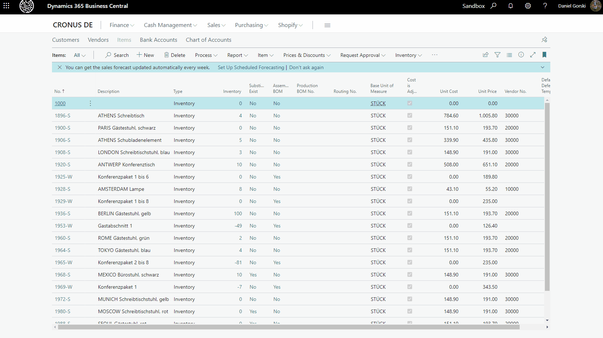

 

 

 

# BeyondAnonymizer

This project is based on [placeholdifer](https://github.com/pomber/placeholdifier).
 We've migrated that project to Manifest V3 and did some additional css work. So a big hug and thanks to [Rodrigo Pombo](https://github.com/pomber).
 Feel free to do your own modifications and please share it with the community!
# Description
Turn your bc website into an anonymized frame for demo and documentation purposes.

# Related

- [beyondit.gmbh](https://beyondit.gmbh)
- [beyondtranslations](https://beyond-translations.de)
- [beyondbarcodes](https://beyond-barcodes.de)
- [beyondcloudconnector](https://beyond-cloudconnector.de)

# Visit our blog
- [beyondit.blog](https://www.beyond365.de/blog)